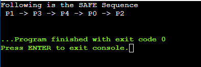

# OS-EX.8-IMPLEMENTATION-OF-BANKER-S-ALGORITHM

### AIM:
To implement the bankers Algorithm
### ALGORITHM:
#### Step 1: Initialize Data
-> Set n to 5 (number of processes) and m to 3 (number of resource types).

-> Initialize the alloc matrix with the allocation of resources to processes.

-> Initialize the max matrix with the maximum demand of resources for each process.

-> Initialize the avail list with the available resources.

-> Initialize arrays f, ans, and ind to manage process states and safe sequence.
### Step 2: Initialize Flags and Need Matrix

-> Initialize the array f to keep track of whether each process is finished (all initially set to 0).

-> Create an empty matrix need to represent the resource needs of each process.
### Step 3: Calculate Need Matrix
Calculate the need matrix by subtracting the alloc matrix from the max matrix for each process and resource.
### Step 4: Main Loop
-> Loop k from 0 to 4 (5 iterations, one for each process).

->Inside the loop:

Loop through each process i (0 to 4).

Check if process i is not finished (f[i] == 0).

Initialize flag to 0.

Loop through each resource type j (0 to 2).

Check if the resource need of process i for resource j exceeds the available resource avail[j].

If it does, set flag to 1 and break out of the inner loop.

If flag is still 0 (i.e., all resource needs are satisfied), add process i to the ans array and increment ind.

Update the available resources by adding the allocated resources of process i to avail.

Mark process i as finished by setting f[i] to 1.
### Step 5: Print the SAFE Sequence
-> Print "Following is the SAFE Sequence" as a header.

-> Loop through the processes in the ans array and print them as the safe sequence, separated by " -> ".

-> Print the last process in the sequence.
### PROGRAM:
~~~
n = 5
m = 3

alloc = [[0, 1, 0 ],[ 2, 0, 0 ],
        [3, 0, 2 ],[2, 1, 1] ,[ 0, 0, 2]]

max = [[7, 5, 3 ],[3, 2, 2 ],
        [ 9, 0, 2 ],[2, 2, 2],[4, 3, 3]]

avail = [3, 3, 2]

f = [0]*n
ans = [0]*n
ind = 0

for k in range(n):
    f[k] = 0

need = [[ 0 for i in range(m)]for i in range(n)]
for i in range(n):
    for j in range(m):
        need[i][j] = max[i][j] - alloc[i][j]
y = 0
for k in range(5):
    for i in range(n):
        if (f[i] == 0):
            flag = 0
            for j in range(m):
                if (need[i][j] > avail[j]):
                    flag = 1
                    break

            if (flag == 0):
                ans[ind] = i
                ind += 1
                for y in range(m):
                    avail[y] += alloc[i][y]
                f[i] = 1

print("Following is the SAFE Sequence")

for i in range(n - 1):
    print(" P", ans[i], " ->", sep="", end="")
print(" P", ans[n - 1], sep="")
~~~
### OUTPUT:

### RESULT:
Thus the program for the bankers algorithm is implemented successfully.
